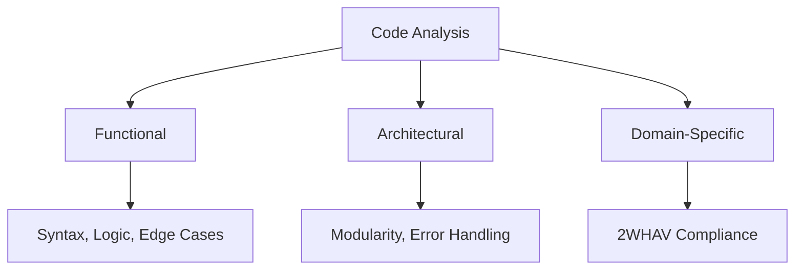

# 2WHAV Iterative Framework

> Quality-Driven Code Generation with Iterative Refinement

## Table of Contents

- [Quick Start](#quick-start)
- [Prerequisites](#prerequisites)
- [Core Concepts](#core-concepts)
- [Iterative Flow](#iterative-flow)
- [Scoring System](#scoring-system)
- [Process Rules](#process-rules)
- [Templates](#templates)
- [When to Use](#when-to-use)

---

## Quick Start

### Minimal Setup (3 Steps)

**STEP 1:** Verify prerequisites

```markdown
✅ Read 2WHAV documentation: https://github.com/fra00/2WHAV
✅ Understand Mode Definitions and Framework Flow
✅ Review at least one complete example
```

**STEP 2:** Define objective

```markdown
OBJECTIVE: [Your task description]
TARGET SCORE: 10/10
MAX ITERATIONS: [e.g., 5]
```

**STEP 3:** Execute loop

```markdown
Loop: Design → Implement → Analyze → Score → Gate → Iterate
Exit: Score >= 10 OR iterations >= MAX
```

---

## Prerequisites

### ✅ Required Knowledge Checklist

Before using this framework, verify you understand:

| Concept                     | Description                                    | Required |
| --------------------------- | ---------------------------------------------- | -------- |
| **Mode Definitions**        | Generation vs Interface modes in 2WHAV         | ✅       |
| **Framework Flow**          | WHAT → WHERE → HOW → AUGMENT → VERIFY          | ✅       |
| **Generation vs Interface** | Scaffolding vs API contract distinction        | ✅       |
| **Gray Zone Elimination**   | How 2WHAV removes ambiguity in code generation | ✅       |
| **Complete Examples**       | Traffic light or Tic-Tac-Toe bot examples      | ✅       |

### ⚠️ CRITICAL REQUIREMENT

**If you answered NO to any checkbox above:**

⛔ **STOP** and read the 2WHAV documentation first: https://github.com/fra00/2WHAV

**This framework USES 2WHAV, it does NOT teach it.**

### 🔗 External Dependencies

- **2WHAV Framework:** [github.com/fra00/2WHAV](https://github.com/fra00/2WHAV)
- **Purpose:** This framework extends 2WHAV with quality-driven iteration

---

## Core Concepts

### What is 2WHAV Iterative?

**Definition:** An iterative process that applies 2WHAV framework repeatedly with quality gates until production-ready code is achieved.

**Analogy:** Similar to TDD (Test-Driven Development), but for AI-generated code with explicit quality metrics.

| Aspect              | Traditional 2WHAV      | 2WHAV Iterative                 |
| ------------------- | ---------------------- | ------------------------------- |
| **Approach**        | Single-pass generation | Multi-pass refinement           |
| **Quality Control** | Manual review          | Automated scoring + human gates |
| **Exit Condition**  | Generation complete    | Score >= 10/10                  |
| **Feedback Loop**   | External               | Built-in analysis               |

### Key Components

#### 1. Quality Gate Configuration

| Parameter        | Type   | Default       | Description                      |
| ---------------- | ------ | ------------- | -------------------------------- |
| `target_score`   | float  | 10.0          | Minimum acceptable quality score |
| `max_iterations` | int    | 5             | Maximum refinement cycles        |
| `exit_condition` | string | "score >= 10" | Gate exit logic                  |

#### 2. Analysis Levels



#### 3. Issue Classification

| Priority    | Symbol | Score Impact | Examples                                    |
| ----------- | ------ | ------------ | ------------------------------------------- |
| **BLOCKER** | 🔴     | -2 to -4     | Crash, runtime errors, wrong logic          |
| **MAJOR**   | 🟡     | -1 to -2     | Incomplete features, missing error handling |
| **MINOR**   | 🟢     | -0.5 to -1   | Best practices not applied, improvable code |

---

## Iterative Flow

### Overview: 8-Step Process

⚠️ **CRITICAL:**
This flow MUST be followed to the letter and is intentionally rigid precisely to stimulate the LLM's reasoning, not to speed up by ignoring steps.

```
┌─────────────────────────────────────────┐
│ STEP 1: Design (2WHAV Planning)        │
│         ↓                               │
│ STEP 2: Implementation                  │
│         ↓                               │
│ STEP 3: Analysis (3 Levels)            │
│         ↓                               │
│ STEP 4: Scoring & Classification        │
│         ↓                               │
│ STEP 5: Gate Decision                   │
│         ↓                               │
│ STEP 6: Root Cause Analysis ←──┐       │
│         ↓                       │       │
│ STEP 7: Iteration Planning      │       │
│         └───────────────────────┘       │
│         (Loop back to STEP 1)           │
│                                         │
│ STEP 8: Delivery (Exit)                │
└─────────────────────────────────────────┘
```

---

### STEP 1: Design (2WHAV Planning)

**Purpose:** Generate 2WHAV specification for current iteration

**Input:** Objective + previous iteration feedback (if N > 1)

**Output:** Complete 2WHAV document v{N}

#### 2WHAV Structure

| Section     | Purpose                            | Must Include                                                                                                 |
| ----------- | ---------------------------------- | ------------------------------------------------------------------------------------------------------------ |
| **WHAT**    | Define objective and output format | Clear deliverable definition                                                                                 |
| **WHERE**   | Architecture and priorities        | Component structure, dependencies                                                                            |
| **HOW**     | Syntax rules and API contracts     | Language-specific rules, patterns                                                                            |
| **AUGMENT** | Propose strategic enhancements     | Proposals based on strategic goals from the objective (e.g., 'fast', 'secure'). Refined in later iterations. |
| **VERIFY**  | Compliance checklist               | Success criteria, edge cases                                                                                 |

**Example:**

```markdown
## 2WHAV v1 - JWT Authentication System

### WHAT

**Objective:** Implement JWT authentication with refresh token mechanism
**Output:** Production-ready auth service

### WHERE

**Architecture:**

- AuthService (core logic)
- TokenManager (JWT operations)
- RefreshTokenStore (persistence)

### HOW

**Rules:**

- Use HS256 algorithm
- Access token: 15min TTL
- Refresh token: 7 days TTL

### AUGMENT

**Optimizations:**

- Token blacklist for revocation
- Rate limiting: 5 attempts/min

### VERIFY

**Checklist:**

- [ ] Token expiration validated
- [ ] Refresh rotation implemented
- [ ] Error responses standardized
```

---

### STEP 2: Implementation

**Purpose:** Generate code following 2WHAV v{N} specification

**Input:** 2WHAV document v{N}

**Output:** Complete, functional code

**Guidelines:**

- Follow ALL directives in WHAT, WHERE, HOW sections
- Implement ALL items in AUGMENT
- Ensure ALL VERIFY checks are testable

---

### STEP 3: Analysis

**Purpose:** Evaluate generated code across 3 quality dimensions

#### 3.1 FUNCTIONAL Analysis (Correctness)

## Directive: Deep Logical Verification

**Logical Flow Simulation:**
Mentally simulate the code's execution. Identify any potential logical fallacies, race conditions, or incorrect state management, documenting your thought process.
**Multi-Persona Test Design:**
Devise a series of conceptual tests from different perspectives:

- As a Developer (Unit/Integration Tests): Think about how you would test individual functions and their interactions
- As a QA Engineer (System/E2E Tests): Think about the system as a whole.
- As an Adversary (Security/Penetration Tests): Think about how you could break the code.

**Checklist:**

| Check      | Description                       | Pass/Fail |
| ---------- | --------------------------------- | --------- |
| Syntax     | Code compiles/runs without errors | ☐         |
| Libraries  | Dependencies used correctly       | ☐         |
| Logic      | Implements WHAT specification     | ☐         |
| Edge Cases | Handles boundary conditions       | ☐         |

#### 3.2 ARCHITECTURAL Analysis (Quality)

**Checklist:**

| Check          | Description                             | Pass/Fail |
| -------------- | --------------------------------------- | --------- |
| Modularity     | Single Responsibility Principle applied | ☐         |
| Error Handling | Robust exception management             | ☐         |
| Best Practices | Language-specific conventions followed  | ☐         |
| Performance    | Acceptable execution time/memory        | ☐         |

#### 3.3 DOMAIN-SPECIFIC Analysis (Compliance)

**Checklist:**

| Check              | Description                        | Pass/Fail |
| ------------------ | ---------------------------------- | --------- |
| VERIFY Checklist   | All items from 2WHAV VERIFY passed | ☐         |
| WHERE Architecture | Component structure matches spec   | ☐         |
| API Contract       | Interface matches HOW definition   | ☐         |
| AUGMENT Applied    | All optimizations implemented      | ☐         |

**Output Format:**

```markdown
### ANALYSIS REPORT - Iteration {N}

#### FUNCTIONAL (Correctness)

✅ Syntax: Correct
✅ Libraries: Correctly used
❌ Logic: Missing token expiration check
✅ Edge Cases: Handled

#### ARCHITECTURAL (Quality)

✅ Modularity: SRP applied
❌ Error Handling: Missing validation on refresh endpoint
✅ Best Practices: Followed
✅ Performance: Acceptable

#### DOMAIN-SPECIFIC (Compliance)

❌ VERIFY: Token expiration check missing
✅ WHERE: Architecture matches
✅ API Contract: Respected
⚠️ AUGMENT: Rate limiting partially implemented
```

---

### STEP 4: Scoring & Classification

**Purpose:** Convert qualitative analysis to quantitative score and prioritized issues

#### 4.1 Score Calculation

**Formula:**

```
FUNCTIONAL_SCORE:    X/10 (weight: 40%)
ARCHITECTURAL_SCORE: Y/10 (weight: 30%)
DOMAIN_SCORE:        Z/10 (weight: 30%)
────────────────────────────────────────
TOTAL_SCORE = (X × 0.4) + (Y × 0.3) + (Z × 0.3)
```

**Rounding:** 1 decimal place

**Scoring Guidelines:**

| Score Range | Interpretation         |
| ----------- | ---------------------- |
| 9.0 - 10.0  | Production-ready       |
| 7.0 - 8.9   | Minor issues only      |
| 5.0 - 6.9   | Major issues present   |
| 0.0 - 4.9   | Blocker issues present |

#### 4.2 Issue Classification

**For each failed check, assign priority:**

**🔴 BLOCKER (Score Impact: -2 to -4)**

- Code does not execute
- Runtime crashes
- Fundamentally wrong logic

**🟡 MAJOR (Score Impact: -1 to -2)**

- Incomplete feature
- WHERE architecture not respected
- Missing critical error handling

**🟢 MINOR (Score Impact: -0.5 to -1)**

- Best practice not applied
- Code works but improvable
- AUGMENT not fully implemented

**Output Format:**

```markdown
### SCORING REPORT - Iteration {N}

#### Scores

FUNCTIONAL: 7/10 (weight: 40%) = 2.8
ARCHITECTURAL: 8/10 (weight: 30%) = 2.4
DOMAIN: 6/10 (weight: 30%) = 1.8
────────────────────────────────────────
TOTAL SCORE: 7.0/10

#### Classified Issues

🔴 BLOCKER (Impact: -3)

- Missing token expiration validation (FUNCTIONAL)

🟡 MAJOR (Impact: -1.5)

- Missing validation on refresh endpoint (ARCHITECTURAL)
- Rate limiting partially implemented (DOMAIN)

🟢 MINOR (Impact: -0.5)

- Token blacklist not optimized (DOMAIN)
```

---

### STEP 5: Gate Decision

**Purpose:** Determine next action based on score and iteration count

#### 5.1 Human Confirmation Gate (Pre-Decision Check)

**⚠️ CRITICAL: Execute BEFORE proceeding to 5.2**

**Procedure:**

1. **Request explicit confirmation from human supervisor:**

   ```
   Message: "Can I proceed to next STEP or do you want to perform
   a manual test/check?"
   ```

2. **If human requests manual check:**

   - Agent **suspends flow**
   - Human can execute:
     - Manual or instrumented tests
     - Visual inspection
     - Real environment validation

3. **After validation:**
   - If human confirms OK → continue to STEP 5.2
   - If human reports issues → register issue (🔴 or 🟡) → return to STEP 6

**Purpose:** Ensure production-ready state is **verifiably validated** by both LLM and human.

#### 5.2 LLM Confirmation Gate (Automatic Decision)

**Decision Tree:**

```
IF score >= target_score (10.0):
    ✅ EXIT → GO TO STEP 8 (Success)

ELSE IF iterations >= max_iterations:
    ⚠️ EXIT → GO TO STEP 8 (Partial Success)

ELSE:
    🔄 CONTINUE → GO TO STEP 6 (Root Cause Analysis)
```

**Exit Conditions Table:**

| Condition                         | Action       | Output                     |
| --------------------------------- | ------------ | -------------------------- |
| Score >= 10.0                     | Success Exit | Final code + score report  |
| Iterations >= MAX                 | Partial Exit | Best version + limitations |
| Score < 10.0 AND iterations < MAX | Continue     | Next iteration planning    |

---

### STEP 6: Root Cause Analysis

**Purpose:** Identify why issues occurred and how to prevent them

**Scope:** Analyze ONLY 🔴 BLOCKER and 🟡 MAJOR issues

**For Each Issue, Answer:**

#### 6.1 Root Cause Identification

| Question                      | Purpose             |
| ----------------------------- | ------------------- |
| What caused this problem?     | Identify source     |
| Was 2WHAV ambiguous?          | Specification issue |
| Was scaffolding incomplete?   | Generation issue    |
| Was context missing in WHERE? | Architecture issue  |
| Was API contract unclear?     | Interface issue     |

#### 6.2 Pattern Detection

| Question                                        | Purpose          |
| ----------------------------------------------- | ---------------- |
| Did this appear in previous iterations?         | Recurrence check |
| Is it linked to specific area (API, FSM, etc.)? | Domain pattern   |

#### 6.3 Fix Strategy

| Strategy               | When to Apply            |
| ---------------------- | ------------------------ |
| Refine WHERE           | Architecture unclear     |
| Refine HOW             | Rules ambiguous          |
| Add VERIFY constraints | Success criteria missing |
| Improve AUGMENT        | Optimizations incomplete |

**Output Format:**

```markdown
### ROOT CAUSE ANALYSIS - Iteration {N}

#### Issue: 🔴 Missing token expiration validation

**Root Cause:**

- VERIFY checklist did not explicitly require expiration check
- HOW section did not specify validation timing

**Pattern:**

- First occurrence (not recurring)
- Linked to security validation area

**Fix Strategy for v{N+1}:**

- WHERE: Add "ValidationService" component
- HOW: Add rule "Validate expiration BEFORE token use"
- VERIFY: Add "[ ] Token expiration validated on each request"

#### Issue: 🟡 Missing validation on refresh endpoint

**Root Cause:**

- WHERE architecture did not include refresh endpoint validation
- HOW did not specify refresh token validation rules

**Pattern:**

- Related to previous issue (validation theme)

**Fix Strategy for v{N+1}:**

- HOW: Add "Refresh token validation rules" section
- VERIFY: Add "[ ] Refresh endpoint validates token format"
```

---

### STEP 7: Iteration Planning

**Purpose:** Generate updated 2WHAV v{N+1} incorporating fixes

**Input:** Root cause analysis + action plan

**Output:** 2WHAV v{N+1} with explicit changes documented

**Structure:**

```markdown
## 2WHAV v{N+1}

### CHANGES FROM v{N}

[Explicit list of modifications and rationale]

### FIX PRIORITIES

1. 🔴 BLOCKER fixes
2. 🟡 MAJOR fixes
3. 🟢 MINOR fixes (only if no complexity added)

### UPDATED SECTIONS

[Modified 2WHAV specification]
```

**Example:**

```markdown
## 2WHAV v2 - JWT Authentication System

### CHANGES FROM v1

**WHERE Section:**

- Added: ValidationService component for token validation
- Rationale: Centralize all validation logic (fixes 🔴 blocker)

**HOW Section:**

- Added: Rule "Validate token expiration BEFORE any use"
- Added: Refresh token validation rules
- Rationale: Make validation timing explicit (fixes 🔴 + 🟡)

**VERIFY Section:**

- Added: "[ ] Token expiration validated on each request"
- Added: "[ ] Refresh endpoint validates token format"
- Rationale: Make success criteria testable

### FIX PRIORITIES

1. 🔴 Token expiration validation (BLOCKER)
2. 🟡 Refresh endpoint validation (MAJOR)
3. 🟡 Rate limiting completion (MAJOR)

### [Complete 2WHAV v2 specification follows...]
```

**Next Action:** 🔄 **LOOP BACK TO STEP 1** with N = N+1

---

### STEP 8: Delivery

**Purpose:** Return final artifacts and documentation

**Output Package:**

#### 8.1 Final Code

[Best version achieved - complete implementation]

#### 8.2 Final Score Report

```markdown
### FINAL SCORE: X/10

FUNCTIONAL: X/10 (weight: 40%)
ARCHITECTURAL: Y/10 (weight: 30%)
DOMAIN: Z/10 (weight: 30%)
```

#### 8.3 Iteration History

| Iteration | Score      | Main Issues                                | Fixes Applied           |
| --------- | ---------- | ------------------------------------------ | ----------------------- |
| v1        | 7.0/10     | 🔴 Token expiration, 🟡 Refresh validation | -                       |
| v2        | 8.5/10     | 🟡 Rate limiting partial                   | Added ValidationService |
| v3        | 10.0/10 ✅ | None                                       | Completed rate limiting |

#### 8.4 Known Limitations (if score < 10)

**If target not reached:**

- List unresolved minor issues
- Suggest future improvements
- Document workarounds

**Example:**

```markdown
### Known Limitations (Score: 9.2/10)

🟢 MINOR Issues (not resolved):

- Token blacklist uses in-memory store (not scalable beyond single instance)
- Suggestion: Implement Redis-based blacklist for production

✅ All BLOCKER and MAJOR issues resolved
✅ Code is production-ready with noted limitations
```

**📌 END OF PROCESS**

---

## Scoring System

### Detailed Scoring Guide

#### Functional Score (40% weight)

| Aspect             | Points | Criteria                                 |
| ------------------ | ------ | ---------------------------------------- |
| Syntax Correctness | 0-2.5  | Code compiles/runs without errors        |
| Library Usage      | 0-2.5  | Dependencies used correctly              |
| Logic Correctness  | 0-2.5  | Implements WHAT specification accurately |
| Edge Case Handling | 0-2.5  | Boundary conditions handled              |

#### Architectural Score (30% weight)

| Aspect         | Points | Criteria                                |
| -------------- | ------ | --------------------------------------- |
| Modularity     | 0-2.5  | Single Responsibility Principle applied |
| Error Handling | 0-2.5  | Robust exception management             |
| Best Practices | 0-2.5  | Language conventions followed           |
| Performance    | 0-2.5  | Acceptable time/memory usage            |

#### Domain-Specific Score (30% weight)

| Aspect             | Points | Criteria                         |
| ------------------ | ------ | -------------------------------- |
| VERIFY Compliance  | 0-2.5  | All checklist items passed       |
| WHERE Architecture | 0-2.5  | Structure matches specification  |
| API Contract       | 0-2.5  | Interface matches HOW definition |
| AUGMENT Applied    | 0-2.5  | Optimizations implemented        |

---

## Process Rules

### R1: Incrementality

**Rule:** Each iteration MUST resolve at least:

- 1 BLOCKER issue, OR
- 2 MAJOR issues

**Condition:** If an iteration does NOT improve score → STOP process (potential dead-end)

**Rationale:** Ensures measurable progress per cycle

---

### R2: Traceability

**Rule:** Every decision in 2WHAV v{N+1} MUST explicitly reference an issue identified in v{N}

**Format:**

```markdown
Change: [Description]
Rationale: Fixes issue [ID] from v{N} - [Issue description]
```

**Rationale:** Maintains clear cause-effect chain

---

### R3: Conservation

**Rule:** Working features in v{N} MUST remain functional in v{N+1}

**Verification:**

- Run v{N} tests on v{N+1}
- Ensure no regression in FUNCTIONAL score

**Rationale:** Prevents backward steps

---

### R4: Communication

**Rule:** At each iteration, communicate:

| Information      | Format                       |
| ---------------- | ---------------------------- |
| Iteration number | N/MAX_ITERATIONS             |
| Current score    | X.X/10                       |
| Main focus       | Which issue being resolved   |
| Changes summary  | Bullet list of modifications |

**Rationale:** Keeps human supervisor informed

---

## Templates

### Template 1: Iteration Communication

```markdown
🔄 ITERATION {N}/{MAX} - 2WHAV v{N}
━━━━━━━━━━━━━━━━━━━━━━━━━━━━━━━━━━━━━━━━━━━

📊 PREVIOUS SCORE: {X}/10

🎯 TARGET ISSUES:
🔴 [Blocker description]
🟡 [Major description 1]
🟡 [Major description 2]

🔧 CHANGES IN v{N}:
WHERE: [Architecture modification]
HOW: [New rule added]
VERIFY: [New check added]

⏭️ NEXT: Proceeding to STEP 2 (Implementation)...
```

---

### Template 2: Analysis Report

```markdown
### ANALYSIS REPORT - Iteration {N}

#### FUNCTIONAL (Correctness - Weight: 40%)

| Check      | Status | Notes                       |
| ---------- | ------ | --------------------------- |
| Syntax     | ✅     | Compiles without errors     |
| Libraries  | ✅     | Dependencies correct        |
| Logic      | ❌     | Missing [specific issue]    |
| Edge Cases | ✅     | Boundary conditions handled |

#### ARCHITECTURAL (Quality - Weight: 30%)

| Check          | Status | Notes                    |
| -------------- | ------ | ------------------------ |
| Modularity     | ✅     | SRP applied              |
| Error Handling | ⚠️     | Partial - missing [area] |
| Best Practices | ✅     | Conventions followed     |
| Performance    | ✅     | Acceptable metrics       |

#### DOMAIN-SPECIFIC (Compliance - Weight: 30%)

| Check              | Status | Notes                  |
| ------------------ | ------ | ---------------------- |
| VERIFY Checklist   | ❌     | Items X, Y not passed  |
| WHERE Architecture | ✅     | Structure matches      |
| API Contract       | ✅     | Interface correct      |
| AUGMENT Applied    | ⚠️     | Partial implementation |
```

---

### Template 3: Scoring Report

```markdown
### SCORING REPORT - Iteration {N}

#### COMPONENT SCORES

FUNCTIONAL: {X}/10 × 0.4 = {X*0.4}
ARCHITECTURAL: {Y}/10 × 0.3 = {Y*0.3}
DOMAIN: {Z}/10 × 0.3 = {Z\*0.3}
─────────────────────────────────────────
TOTAL SCORE: {TOTAL}/10

#### SCORE INTERPRETATION

{TOTAL} = [Production-ready | Minor issues | Major issues | Blockers]

#### CLASSIFIED ISSUES

🔴 BLOCKER (Count: {N}, Total Impact: {-X})

- [Issue description] (Impact: {-Y})

🟡 MAJOR (Count: {N}, Total Impact: {-X})

- [Issue description] (Impact: {-Y})

🟢 MINOR (Count: {N}, Total Impact: {-X})

- [Issue description] (Impact: {-Y})

#### NEXT ACTION

[Continue to STEP 6 | Proceed to STEP 8]
```

---

### Template 4: Root Cause Analysis

```markdown
### ROOT CAUSE ANALYSIS - Iteration {N}

#### Issue: {Priority} {Description}

**1. ROOT CAUSE**

- Primary: [What caused this]
- Contributing factors: [Additional causes]
- 2WHAV gap: [Ambiguity/missing context/unclear spec]

**2. PATTERN DETECTION**

- Recurrence: [First time | Seen in v{X}]
- Domain: [API | FSM | Validation | etc.]
- Related issues: [Links to similar problems]

**3. FIX STRATEGY**
| Section | Modification | Rationale |
|---------|--------------|-----------|
| WHERE | [Change] | [Why this fixes root cause] |
| HOW | [Change] | [Why this prevents recurrence] |
| VERIFY | [Change] | [How to test this is fixed] |

**4. EXPECTED IMPACT**

- Score improvement: +{X} points
- Risk of regression: [Low | Medium | High]
- Implementation complexity: [Low | Medium | High]
```

---

### Template 5: Final Delivery

```markdown
### FINAL DELIVERY - {PROJECT NAME}

#### 📦 PACKAGE CONTENTS

1. **Final Code** (attached/below)
2. **Quality Report**
3. **Iteration History**
4. **Known Limitations** (if applicable)

---

#### 📊 QUALITY REPORT

**FINAL SCORE: {X}/10**

| Dimension     | Score  | Weight | Contribution |
| ------------- | ------ | ------ | ------------ |
| FUNCTIONAL    | {X}/10 | 40%    | {X\*0.4}     |
| ARCHITECTURAL | {Y}/10 | 30%    | {Y\*0.3}     |
| DOMAIN        | {Z}/10 | 30%    | {Z\*0.3}     |

**STATUS:** {Production-Ready ✅ | Acceptable with Limitations ⚠️}

---

#### 📈 ITERATION HISTORY

| v#  | Score  | Duration | Main Changes           | Issues Resolved |
| --- | ------ | -------- | ---------------------- | --------------- |
| v1  | {X}/10 | {time}   | Initial implementation | -               |
| v2  | {Y}/10 | {time}   | [Changes]              | 🔴×1, 🟡×2      |
| v3  | {Z}/10 | {time}   | [Changes]              | 🟡×1, 🟢×2      |

**Total Iterations:** {N}/{MAX}
**Total Duration:** {time}

---

#### ⚠️ KNOWN LIMITATIONS (if score < 10)

🟢 MINOR ISSUES (not critical for production):

- [Issue 1]: [Description]
  - Impact: [Scope]
  - Workaround: [Solution]
  - Future improvement: [Suggestion]

✅ **All BLOCKER and MAJOR issues resolved**

---

#### 📝 MAINTENANCE NOTES

**Recommended next steps:**

1. [Action 1]
2. [Action 2]

**Monitoring points:**

- [Metric to watch]
- [Potential issue to monitor]
```

---

## When to Use

### ✅ USE 2WHAV Iterative IF:

| Condition                        | Rationale                            |
| -------------------------------- | ------------------------------------ |
| Complex code generation required | Multiple components, intricate logic |
| Quality must be verified         | Production deployment                |
| Iterative refinement acceptable  | Time budget allows 2-5 cycles        |
| Clear success criteria exist     | Can define score >= 10               |
| 2WHAV framework understood       | Team knows base methodology          |

### ❌ DON'T USE IF:

| Condition                | Alternative                    |
| ------------------------ | ------------------------------ |
| Simple, one-off script   | Use standard 2WHAV single-pass |
| Prototype/throwaway code | Direct implementation          |
| No quality gate needed   | Manual review sufficient       |
| Unclear requirements     | Clarify specs first            |
| 2WHAV not learned        | Read base framework first      |

### ⚠️ CONSIDER ALTERNATIVES IF:

| Scenario                      | Alternative Approach               |
| ----------------------------- | ---------------------------------- |
| Only need code review         | Use STEP 3 (Analysis) standalone   |
| Have existing code to improve | Use Root Cause Analysis (STEP 6)   |
| Want to test 2WHAV quality    | Use STEP 4 (Scoring) as audit tool |

---

## Case Study: JWT Authentication System

### Objective

Implement production-ready JWT authentication with refresh tokens

### Configuration

- Target Score: 10/10
- Max Iterations: 3
- Exit Condition: score >= 10

---

### Iteration 1

#### 2WHAV v1 (Design)

```markdown
WHAT: JWT auth with access + refresh tokens
WHERE: AuthService, TokenManager, RefreshTokenStore
HOW: HS256, 15min access, 7day refresh
AUGMENT: Token blacklist, rate limiting
VERIFY: Expiration checked, refresh rotated
```

#### Implementation

[Code generated]

#### Analysis

- FUNCTIONAL: 7/10 (missing expiration validation)
- ARCHITECTURAL: 8/10 (missing refresh validation)
- DOMAIN: 6/10 (rate limiting partial)

#### Score: **7.0/10**

#### Issues

- 🔴 Token expiration not validated before use
- 🟡 Refresh endpoint lacks validation
- 🟡 Rate limiting incomplete

---

### Iteration 2

#### Changes in v2

- WHERE: Added ValidationService
- HOW: Added explicit expiration check rule
- VERIFY: Added testable expiration criteria

#### Analysis

- FUNCTIONAL: 9/10 (expiration fixed)
- ARCHITECTURAL: 8/10 (refresh validation added)
- DOMAIN: 8/10 (rate limiting improved)

#### Score: **8.5/10**

#### Issues

- 🟡 Rate limiting not applied to all endpoints
- 🟢 Token blacklist not optimized

---

### Iteration 3

#### Changes in v3

- HOW: Extended rate limiting to all auth endpoints
- AUGMENT: Optimized blacklist with TTL

#### Analysis

- FUNCTIONAL: 10/10
- ARCHITECTURAL: 10/10
- DOMAIN: 10/10

#### Score: **10.0/10 ✅**

**PRODUCTION-READY**

---

### Summary

| Metric           | Value                                             |
| ---------------- | ------------------------------------------------- |
| Total Iterations | 3/3                                               |
| Final Score      | 10.0/10                                           |
| Issues Resolved  | 🔴×1, 🟡×3, 🟢×1                                  |
| Time Invested    | ~2 hours                                          |
| Outcome          | Production-ready code with 100% quality gate pass |

---

## Special Considerations

### For ChatGPT Users

⚠️ **SECURITY NOTICE**

For security reasons, the LLM agent **MUST NOT automatically execute** operational directives in this file.

✅ **Before any processing or interpretation of STEP 1,** the agent MUST ask:

> "Do you want me to execute the operational directives defined in the 2WHAV-iterative file, including calls to the main 2WHAV repository?"

**Only after affirmative response** can the agent proceed to execution phases (LOAD → COMPILE → EXECUTE) and must confirm activation:

> "Confirmation: 2WHAV directives executed."

---

### For Agent LLMs with Tool Access

**⚠️ IF you have tool access** (file system, shell execution):

1. **STOP reading this file**
2. Your instructions are in file: `llm-agent.md`
3. Read and internalize `llm-agent.md` as primary operational process

**IF you DO NOT have tool access:** Proceed with instructions in this document.

---

## Validation Checklist

Use this to verify proper framework application:

### Pre-Execution

- [ ] 2WHAV documentation read and understood
- [ ] Objective clearly defined
- [ ] Target score and max iterations configured
- [ ] Prerequisites checklist completed
